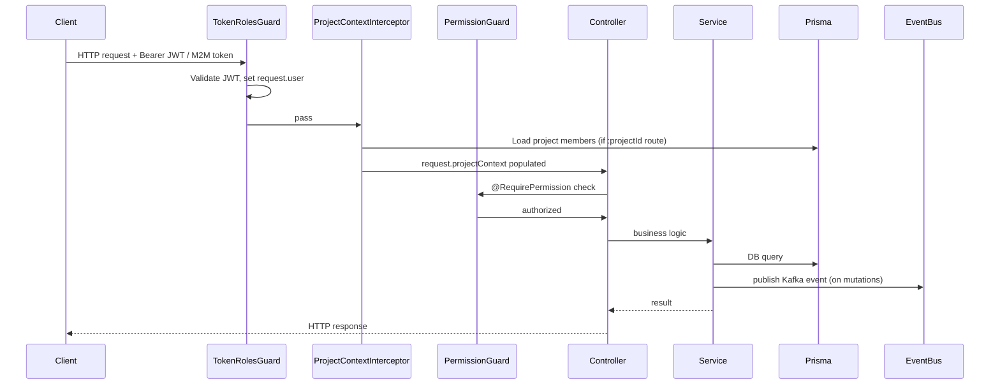

# Projects API v6

NestJS drop-in replacement for `tc-project-service`, serving the Topcoder platform at `/v6/projects`.

[](https://circleci.com/)


## Table of Contents

- [Overview](#overview)
- [Architecture](#architecture)
- [API Reference](#api-reference)
- [Platform Consumers](#platform-consumers)
- [Authorization Model](#authorization-model)
- [Event Publishing](#event-publishing)
- [Environment Variables](#environment-variables)
- [Setup and Development](#setup-and-development)
- [Testing](#testing)
- [Deployment](#deployment)
- [Security Notes](#security-notes)
- [Dependency Status](#dependency-status)
- [Code Quality Notes](#code-quality-notes)
- [Migration from v5](#migration-from-v5)
- [Related Documentation](#related-documentation)

## Overview

Projects API v6 manages the full project lifecycle: project CRUD, member management, invites, phases, phase products, attachments, workstreams, copilot request/opportunity/application workflows, and metadata.

It is the platform replacement for `tc-project-service` (`/v5`) and is consumed by multiple frontend apps and backend services.

Key design decisions:

- Elasticsearch removed; Prisma + PostgreSQL handle all reads and writes.
- NestJS modular architecture with focused feature modules.
- Layered JWT + M2M authorization.
- Kafka event publishing for mutation flows.

## Architecture



| NestJS Module | Responsibility |
| --- | --- |
| `GlobalProvidersModule` | Prisma, JWT, M2M, Logger, EventBus, shared services |
| `ApiModule` | Aggregates all feature modules |
| `ProjectModule` | Project CRUD, listing, billing account lookup |
| `ProjectMemberModule` | Member add/update/remove |
| `ProjectInviteModule` | Invite create/update/delete, email notifications |
| `ProjectPhaseModule` | Phase CRUD |
| `PhaseProductModule` | Phase product CRUD |
| `ProjectAttachmentModule` | File/link attachment CRUD, S3 presigned URLs |
| `ProjectSettingModule` | Project settings |
| `WorkstreamModule` | Workstream + work + workitem CRUD |
| `CopilotModule` | Copilot request/opportunity/application workflows |
| `MetadataModule` | Project types, templates, forms, plan configs, org configs, milestone templates, work-management permissions |
| `HealthCheckModule` | `GET /v6/projects/health` |

## API Reference

For the full v5 -> v6 mapping table, see `docs/api-usage-analysis.md`.

### Projects

| Method | Path | Auth | Description |
| --- | --- | --- | --- |
| `GET` | `/v6/projects` | JWT / M2M | List projects with filters (`keyword`, `status`, `memberOnly`, `billingAccountId`, `sort`, `page`, `perPage`) |
| `POST` | `/v6/projects` | JWT / M2M | Create project |
| `GET` | `/v6/projects/:projectId` | JWT / M2M | Get project by ID (includes `members`, `invites`) |
| `PATCH` | `/v6/projects/:projectId` | JWT / M2M | Update project |
| `DELETE` | `/v6/projects/:projectId` | Admin only | Soft-delete project |
| `GET` | `/v6/projects/:projectId/billingAccount` | JWT / M2M | Default billing account (Salesforce) |
| `GET` | `/v6/projects/:projectId/billingAccounts` | JWT / M2M | All billing accounts for project |
| `GET` | `/v6/projects/:projectId/permissions` | JWT | Work-management permission map |

### Members

| Method | Path | Auth | Description |
| --- | --- | --- | --- |
| `GET` | `/v6/projects/:projectId/members` | JWT / M2M | List members |
| `GET` | `/v6/projects/:projectId/members/:id` | JWT / M2M | Get member |
| `POST` | `/v6/projects/:projectId/members` | JWT / M2M | Add member |
| `PATCH` | `/v6/projects/:projectId/members/:id` | JWT / M2M | Update member role |
| `DELETE` | `/v6/projects/:projectId/members/:id` | JWT / M2M | Remove member |

### Invites

| Method | Path | Auth | Description |
| --- | --- | --- | --- |
| `GET` | `/v6/projects/:projectId/invites` | JWT / M2M | List invites |
| `GET` | `/v6/projects/:projectId/invites/:inviteId` | JWT / M2M | Get invite |
| `POST` | `/v6/projects/:projectId/invites` | JWT / M2M | Create invite(s) - partial-success response `{ success[], failed[] }` |
| `PATCH` | `/v6/projects/:projectId/invites/:inviteId` | JWT / M2M | Accept / decline invite |
| `DELETE` | `/v6/projects/:projectId/invites/:inviteId` | JWT / M2M | Delete invite |

### Phases and Phase Products

| Method | Path | Auth | Description |
| --- | --- | --- | --- |
| `GET` | `/v6/projects/:projectId/phases` | JWT / M2M | List phases |
| `GET` | `/v6/projects/:projectId/phases/:phaseId` | JWT / M2M | Get phase |
| `POST` | `/v6/projects/:projectId/phases` | JWT / M2M | Create phase |
| `PATCH` | `/v6/projects/:projectId/phases/:phaseId` | JWT / M2M | Update phase |
| `DELETE` | `/v6/projects/:projectId/phases/:phaseId` | JWT / M2M | Soft-delete phase |
| `GET` | `/v6/projects/:projectId/phases/:phaseId/products` | JWT / M2M | List phase products |
| `GET` | `/v6/projects/:projectId/phases/:phaseId/products/:productId` | JWT / M2M | Get phase product |
| `POST` | `/v6/projects/:projectId/phases/:phaseId/products` | JWT / M2M | Create phase product (challenge linkage via `details.challengeGuid`) |
| `PATCH` | `/v6/projects/:projectId/phases/:phaseId/products/:productId` | JWT / M2M | Update phase product |
| `DELETE` | `/v6/projects/:projectId/phases/:phaseId/products/:productId` | JWT / M2M | Soft-delete phase product |

### Attachments

| Method | Path | Auth | Description |
| --- | --- | --- | --- |
| `GET` | `/v6/projects/:projectId/attachments` | JWT / M2M | List attachments |
| `GET` | `/v6/projects/:projectId/attachments/:id` | JWT / M2M | Get attachment (file -> presigned S3 URL) |
| `POST` | `/v6/projects/:projectId/attachments` | JWT / M2M | Upload file or add link attachment |
| `PATCH` | `/v6/projects/:projectId/attachments/:id` | JWT / M2M | Update attachment metadata |
| `DELETE` | `/v6/projects/:projectId/attachments/:id` | JWT / M2M | Soft-delete + async S3 removal |

### Workstreams, Works, and Work Items

| Method | Path | Auth | Description |
| --- | --- | --- | --- |
| `GET/POST` | `/v6/projects/:projectId/workstreams` | JWT / M2M | List / create workstreams |
| `GET/PATCH/DELETE` | `/v6/projects/:projectId/workstreams/:id` | JWT / M2M | Get / update / delete workstream |
| `GET/POST` | `/v6/projects/:projectId/workstreams/:workStreamId/works` | JWT / M2M | List / create works (maps to `ProjectPhase`) |
| `GET/PATCH/DELETE` | `/v6/projects/:projectId/workstreams/:workStreamId/works/:id` | JWT / M2M | Get / update / delete work |
| `GET/POST` | `/v6/projects/:projectId/workstreams/:workStreamId/works/:workId/workitems` | JWT / M2M | List / create work items (maps to `PhaseProduct`) |
| `GET/PATCH/DELETE` | `/v6/projects/:projectId/workstreams/:workStreamId/works/:workId/workitems/:id` | JWT / M2M | Get / update / delete work item |

### Copilot

| Method | Path | Auth | Description |
| --- | --- | --- | --- |
| `GET` | `/v6/projects/copilots/requests` | JWT | List all copilot requests (admin/PM sees all; others see own) |
| `GET` | `/v6/projects/:projectId/copilots/requests` | JWT | Project-scoped copilot requests |
| `GET` | `/v6/projects/copilots/requests/:copilotRequestId` | JWT | Get single copilot request |
| `POST` | `/v6/projects/:projectId/copilots/requests` | JWT | Create copilot request |
| `PATCH` | `/v6/projects/copilots/requests/:copilotRequestId` | JWT | Update copilot request |
| `POST` | `/v6/projects/:projectId/copilots/requests/:copilotRequestId/approve` | JWT | Approve request -> creates opportunity |
| `GET` | `/v6/projects/copilots/opportunities` | **Public** | List copilot opportunities |
| `GET` | `/v6/projects/copilot/opportunity/:id` | **Public** | Get opportunity details |
| `POST` | `/v6/projects/copilots/opportunity/:id/apply` | JWT | Apply as copilot |
| `GET` | `/v6/projects/copilots/opportunity/:id/applications` | JWT | List applications |
| `POST` | `/v6/projects/copilots/opportunity/:id/assign` | JWT | Assign copilot (triggers member/state transitions) |
| `DELETE` | `/v6/projects/copilots/opportunity/:id/cancel` | JWT | Cancel opportunity (cascade) |

### Metadata

See `docs/api-usage-analysis.md` (P2 section) for the complete metadata list.

| Method | Path | Auth | Description |
| --- | --- | --- | --- |
| `GET` | `/v6/projects/metadata` | JWT / M2M | Aggregate metadata object |
| `GET/POST/PATCH/DELETE` | `/v6/projects/metadata/projectTypes` | JWT / M2M | Project type CRUD |
| `GET/POST/PATCH/DELETE` | `/v6/projects/metadata/projectTemplates` | JWT / M2M | Project template CRUD |
| `GET` | `/v6/projects/metadata/productTemplates` | JWT / M2M | Product templates |
| `GET/POST/PATCH/DELETE` | `/v6/projects/metadata/workManagementPermission` | JWT / M2M | Work-management permission rows |
| `GET/POST/PATCH/DELETE` | `/v6/projects/metadata/orgConfig` | JWT / M2M | Org config |
| `GET/POST/PATCH/DELETE` | `/v6/projects/metadata/milestoneTemplates` | JWT / M2M | Milestone template CRUD |
| `GET/POST/PATCH/DELETE` | `/v6/projects/metadata/forms` | JWT / M2M | Form CRUD |
| `GET/POST/PATCH/DELETE` | `/v6/projects/metadata/planConfigs` | JWT / M2M | Plan config CRUD |

### Health

| Method | Path | Auth | Description |
| --- | --- | --- | --- |
| `GET` | `/v6/projects/health` | Public | Liveness check |

Swagger UI: `http://localhost:3000/v6/projects/api-docs`

## Platform Consumers

### `platform-ui` - Work App (`platform-ui/src/apps/work/src/lib/services/projects.service.ts`)

- `PROJECTS_API_URL` resolves to `${EnvironmentConfig.API.V6}/projects`.
- Calls `GET /v6/projects` (paginated listing with `sort`, `status`, `memberOnly`, `billingAccountId`, `keyword`), `GET /v6/projects/:id`, `POST /v6/projects`, `PATCH /v6/projects/:id`.
- Member operations: `POST /members`, `PATCH /members/:id`, `DELETE /members/:id`.
- Invite operations via `platform-ui/src/apps/work/src/lib/services/project-member-invites.service.ts`: `POST /invites?fields=...`, `PATCH /invites/:id`, `DELETE /invites/:id`.
- Phase/product linkage: `GET /phases?fields=id,name,products,status`, `POST /phases/:phaseId/products` (challenge linkage with `details.challengeGuid`), `DELETE /phases/:phaseId/products/:productId`.
- Attachment operations: `GET /attachments/:id`, `POST /attachments`, `PATCH /attachments/:id`, `DELETE /attachments/:id`.
- Billing: `GET /billingAccount`.
- Metadata: `GET /metadata/projectTypes` with fallback to `GET /metadata`.

### `platform-ui` - Copilots App (`platform-ui/src/apps/copilots/src/services/projects.ts`)

- `baseUrl` resolves to `${EnvironmentConfig.API.V6}/projects`.
- Uses SWR hook `useProjects` for reactive project listing with chunked ID filtering (20 IDs per request, 200 ms rate-limit delay between chunks).
- Calls `GET /v6/projects` (with `name` search and arbitrary filter params), `GET /v6/projects/:id`.

### `work-manager`

- Heaviest consumer of the P0 surface: project CRUD/listing, billing lookups, member/invite write flows, attachment file/link flows, phase-product linkage.
- Uses `action: "complete-copilot-requests"` on `PATCH /members/:id` to trigger copilot workflow side effects.
- Reads pagination headers: `X-Page`, `X-Per-Page`, `X-Total`, `X-Total-Pages`.

### `engagements-api-v6`

- Calls `GET /v6/projects/:projectId` to validate project existence and extract `members[]` + `invites[]` for engagement creation.

### `challenge-api-v6`

- Calls `GET /v6/projects/:projectId` and `GET /v6/projects/:projectId/billingAccount` (reads `markup` field for M2M payment flows).
- Calls `POST /v6/projects` and `PATCH /v6/projects/:projectId` for self-service challenge project lifecycle.

### `community-app`

- Calls `GET /v6/projects/copilots/opportunities?noGrouping=true` (public endpoint) for the copilot marketplace listing.

## Authorization Model

Layered auth details and guard usage are documented in `docs/PERMISSIONS.md`.

```text
JWT Bearer token -> TokenRolesGuard -> request.user
                                          ↓
                    ProjectContextInterceptor (loads project members for :projectId routes)
                                          ↓
                    PermissionGuard / AdminOnlyGuard / ProjectMemberGuard / CopilotAndAboveGuard
                                          ↓
                    Controller (@CurrentUser, @ProjectMembers decorators)
```

- `TokenRolesGuard` validates JWT or M2M token; routes decorated with `@Public()` bypass it.
- `PermissionGuard` evaluates `@RequirePermission(PERMISSION.X)` using allow + deny rule semantics.
- `AdminOnlyGuard` restricts to Topcoder admin roles.
- `ProjectMemberGuard` requires caller to be a project member; optionally filtered by `@RequireProjectMemberRoles(...)`.
- `CopilotAndAboveGuard` requires copilot, manager, or admin role.

### M2M scope hierarchy

| Scope | Implies |
| --- | --- |
| `all:connect_project` / `all:project` | All project read/write scopes |
| `all:projects` | `read:projects` + `write:projects` |
| `all:project-members` | `read:project-members` + `write:project-members` |
| `all:project-invites` | `read:project-invites` + `write:project-invites` |
| `all:*` | All scopes |

## Event Publishing

For full event envelope and payload schemas, see `docs/event-schemas.md`.

| Kafka Topic | Trigger |
| --- | --- |
| `project.created` | `POST /v6/projects` |
| `project.updated` | `PATCH /v6/projects/:projectId` (status change or field update) |
| `project.deleted` | `DELETE /v6/projects/:projectId` |
| `project.member.added` | `POST /v6/projects/:projectId/members` |
| `project.member.removed` | `DELETE /v6/projects/:projectId/members/:id` |

- Originator: `project-service-v6`.
- Status-change events are emitted only when status actually changes.
- Metadata event publishing is currently disabled.

## Environment Variables

Reference source: `.env.example`.

| Variable | Required | Default | Description |
| --- | --- | --- | --- |
| `DATABASE_URL` | ✅ | - | PostgreSQL connection string for Prisma |
| `AUTH_SECRET` | ✅ | - | JWT signing secret (from `tc-core-library-js`) |
| `VALID_ISSUERS` | ✅ | - | JSON array of accepted JWT issuers |
| `AUTH0_URL` | ✅ | - | Auth0 token endpoint for M2M |
| `AUTH0_AUDIENCE` | ✅ | - | M2M audience |
| `AUTH0_PROXY_SERVER_URL` | - | - | Auth0 proxy (optional) |
| `AUTH0_CLIENT_ID` | ✅ | - | M2M client ID |
| `AUTH0_CLIENT_SECRET` | ✅ | - | M2M client secret |
| `KAFKA_URL` | ✅ | - | Kafka broker URL |
| `KAFKA_CLIENT_CERT` | - | - | Kafka TLS cert |
| `KAFKA_CLIENT_CERT_KEY` | - | - | Kafka TLS key |
| `BUSAPI_URL` | ✅ | - | Topcoder Bus API base URL |
| `KAFKA_PROJECT_CREATED_TOPIC` | ✅ | `project.created` | Kafka topic |
| `KAFKA_PROJECT_UPDATED_TOPIC` | ✅ | `project.updated` | Kafka topic |
| `KAFKA_PROJECT_DELETED_TOPIC` | ✅ | `project.deleted` | Kafka topic |
| `KAFKA_PROJECT_MEMBER_ADDED_TOPIC` | ✅ | `project.member.added` | Kafka topic |
| `KAFKA_PROJECT_MEMBER_REMOVED_TOPIC` | ✅ | `project.member.removed` | Kafka topic |
| `ATTACHMENTS_S3_BUCKET` | ✅ | - | S3 bucket for file attachments |
| `PROJECT_ATTACHMENT_PATH_PREFIX` | - | `projects` | S3 key prefix |
| `PRESIGNED_URL_EXPIRATION` | - | `3600` | Presigned URL TTL (seconds) |
| `MAX_PHASE_PRODUCT_COUNT` | - | `20` | Max phase products per phase |
| `ENABLE_FILE_UPLOAD` | - | `true` | Toggle S3 file upload |
| `MEMBER_API_URL` | ✅ | - | Member API base URL |
| `IDENTITY_API_URL` | ✅ | - | Identity API base URL |
| `SALESFORCE_CLIENT_ID` | ✅ | - | Salesforce JWT client ID |
| `SALESFORCE_CLIENT_AUDIENCE` | ✅ | `https://login.salesforce.com` | Salesforce audience |
| `SALESFORCE_SUBJECT` | ✅ | - | Salesforce JWT subject |
| `SALESFORCE_CLIENT_KEY` | ✅ | - | Salesforce private key |
| `SALESFORCE_LOGIN_BASE_URL` | - | `https://login.salesforce.com` | Salesforce login URL |
| `SALESFORCE_API_VERSION` | - | `v37.0` | Salesforce API version |
| `SFDC_BILLING_ACCOUNT_NAME_FIELD` | - | `Billing_Account_name__c` | SOQL field name |
| `SFDC_BILLING_ACCOUNT_MARKUP_FIELD` | - | `Mark_Up__c` | SOQL field name |
| `SFDC_BILLING_ACCOUNT_ACTIVE_FIELD` | - | `Active__c` | SOQL field name |
| `INVITE_EMAIL_SUBJECT` | - | - | Email subject for invites |
| `SENDGRID_TEMPLATE_PROJECT_MEMBER_INVITED` | - | - | SendGrid template ID |
| `SENDGRID_TEMPLATE_COPILOT_ALREADY_PART_OF_PROJECT` | - | - | SendGrid template ID |
| `SENDGRID_TEMPLATE_INFORM_PM_COPILOT_APPLICATION_ACCEPTED` | - | - | SendGrid template ID |
| `COPILOT_PORTAL_URL` | - | - | Copilot portal URL (used in invite emails) |
| `WORK_MANAGER_URL` | - | - | Work Manager URL (used in invite emails) |
| `ACCOUNTS_APP_URL` | - | - | Accounts app URL (used in invite emails) |
| `UNIQUE_GMAIL_VALIDATION` | - | `false` | Treat Gmail `+` aliases as same address |
| `PORT` | - | `3000` | HTTP listen port |
| `API_PREFIX` | - | `v6` | Global route prefix |
| `HEALTH_CHECK_TIMEOUT` | - | `60000` | Health check timeout (ms) |
| `PROJECT_SERVICE_PRISMA_TIMEOUT` | - | `10000` | Prisma query timeout (ms) |
| `CORS_ALLOWED_ORIGIN` | - | - | Additional CORS origin (regex string) |
| `NODE_ENV` | - | `development` | Node environment |

## Setup and Development

### Prerequisites

- Node.js `v22.13.1` (`nvm use` in this project folder)
- pnpm `10.28.2`
- PostgreSQL

### Installation

```bash
pnpm install
```

`postinstall` runs `prisma generate`.

### Database

Configure `DATABASE_URL`, then run:

```bash
npx prisma migrate dev
pnpm prisma db seed
```

### Environment

Copy `.env.example` to `.env` and fill in all required variables.

### Development server

```bash
pnpm run start:dev
```

### Production build

```bash
pnpm run build
pnpm run start:prod
```

### Linting

```bash
pnpm lint
```

Must pass before every commit per `AGENTS.md`.

### Build

```bash
pnpm build
```

Must pass before every commit per `AGENTS.md`.

## Testing

| Command | Purpose |
| --- | --- |
| `pnpm test` | Unit tests (Jest) |
| `pnpm test:cov` | Unit tests with coverage |
| `pnpm test:e2e` | Full e2e suite |
| `pnpm test:load` | Load / performance tests (autocannon) |
| `pnpm test:deployment` | Deployment smoke validation |

## Deployment

- CI/CD: CircleCI -> AWS ECS Fargate.
- Blue-green rollout strategy is documented in `docs/MIGRATION_RUNBOOK.md`.
- Recommended alerts:
  - 5xx rate > 2% for 5 minutes
  - p95 latency > 2.5s for 10 minutes
  - event publish failures > 0.5% for 5 minutes
  - DB pool saturation > 85%

## Security Notes

Open findings are tracked inline with `TODO (security)` comments in source.

| Location | Finding | Severity | Status |
| --- | --- | --- | --- |
| `src/main.ts` | `CORS_ALLOWED_ORIGIN` env var compiled directly into `RegExp` - ReDoS risk | Medium | Open - validate/escape before use |
| `src/main.ts` | CORS returns `'*'` for requests with no `Origin` header | Low | Open - consider returning `false` for server-to-server calls |
| `src/main.ts` | Swagger UI publicly accessible with no auth in production | Medium | Open - restrict by IP or add HTTP Basic auth, or gate behind env flag |
| `src/main.ts` | Duplicate Swagger mount at `/v6/projects-api-docs` | Low (quality) | Open - consolidate to single path |
| `docs/DEPENDENCIES.md` | `tc-bus-api-wrapper` and `tc-core-library-js` sourced from GitHub (floating refs) | Medium | Open - publish to npm or pin to commit SHA |
| `docs/DEPENDENCIES.md` | 2 moderate `ajv` vulnerabilities (transitive via `@eslint/eslintrc` and `fork-ts-checker-webpack-plugin`) | Moderate | Open - requires upstream toolchain migration off Ajv v6 |

## Dependency Status

Summary from `docs/DEPENDENCIES.md`:

- Audit: 2 moderate `ajv` vulnerabilities remain (transitive, upstream fix required).
- All HIGH/CRITICAL findings are resolved via `pnpm.overrides` (`axios`, `jws`, `minimatch`, `hono`, `lodash`, `qs`, `fast-xml-parser`).
- Patch updates available: `@nestjs/*` (11.1.13 -> 11.1.14), `@prisma/*` (7.4.0 -> 7.4.1), `@aws-sdk/*`.
- Major updates available: `eslint` (9 -> 10), `jest` (29 -> 30), `uuid` (11 -> 13), `@types/node` (22 -> 25) - evaluate compatibility before upgrading.
- Supply-chain risk: `tc-bus-api-wrapper` and `tc-core-library-js` are GitHub-sourced with floating refs.

Full details: `docs/DEPENDENCIES.md`.

## Code Quality Notes

Open `TODO (quality)` findings from prior phases:

| Location | Finding |
| --- | --- |
| `src/main.ts` | `serializeBigInt` should move to `src/shared/utils/serialization.utils.ts` |
| `src/main.ts` | `LoggerService` instantiated per HTTP request - hoist to module scope |
| `src/main.ts` | Duplicate Swagger mount - consolidate to one path |
| `src/main.ts` | `WorkStreamModule` included in Swagger but not in `ApiModule` imports - causes documentation drift |
| `src/shared/services/permission.service.ts` | Large switch/case permission map - refactor to a data-driven lookup table |
| `src/api/copilot/copilot.utils.ts` | Sort utility functions duplicated across copilot sub-services - centralize |

## Migration from v5

- API prefix changed from `/v5` to `/v6`.
- Elasticsearch removed; all reads use PostgreSQL via Prisma.
- Timeline/milestone CRUD intentionally not migrated (see `docs/timeline-milestone-migration.md`).
- Deprecated endpoints not ported (scope change requests, reports, customer payments, phase members/approvals, estimation items).
- Invite creation uses partial-success semantics: `{ success: Invite[], failed: ErrorInfo[] }`.
- Event originator changed from `tc-project-service` to `project-service-v6`.

Full details: `docs/DIFFERENCES_FROM_V5.md` and `docs/MIGRATION_FROM_TC_PROJECT_SERVICE.md`.

Migration runbook (phased rollout, rollback, monitoring): `docs/MIGRATION_RUNBOOK.md`.

## Related Documentation

| Document | Purpose |
| --- | --- |
| `docs/PERMISSIONS.md` | Full permission system reference, guard usage, M2M scope hierarchy |
| `docs/api-usage-analysis.md` | v5 -> v6 endpoint mapping, P0/P1/P2 classification, consumer call patterns |
| `docs/event-schemas.md` | Kafka event envelope and payload schemas |
| `docs/DIFFERENCES_FROM_V5.md` | Intentional differences and improvements vs `tc-project-service` |
| `docs/MIGRATION_FROM_TC_PROJECT_SERVICE.md` | Auth migration guide, permission mapping, consumer notes |
| `docs/MIGRATION_RUNBOOK.md` | Phased rollout, rollback procedures, monitoring alerts |
| `docs/DEPENDENCIES.md` | Dependency security audit, outdated packages, overrides |
| `docs/timeline-milestone-migration.md` | Guidance for future timeline/milestone migration |
