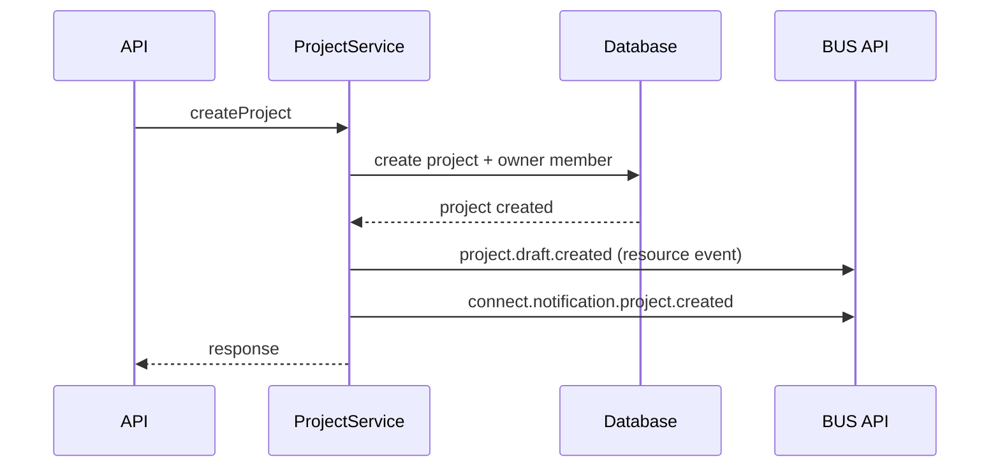
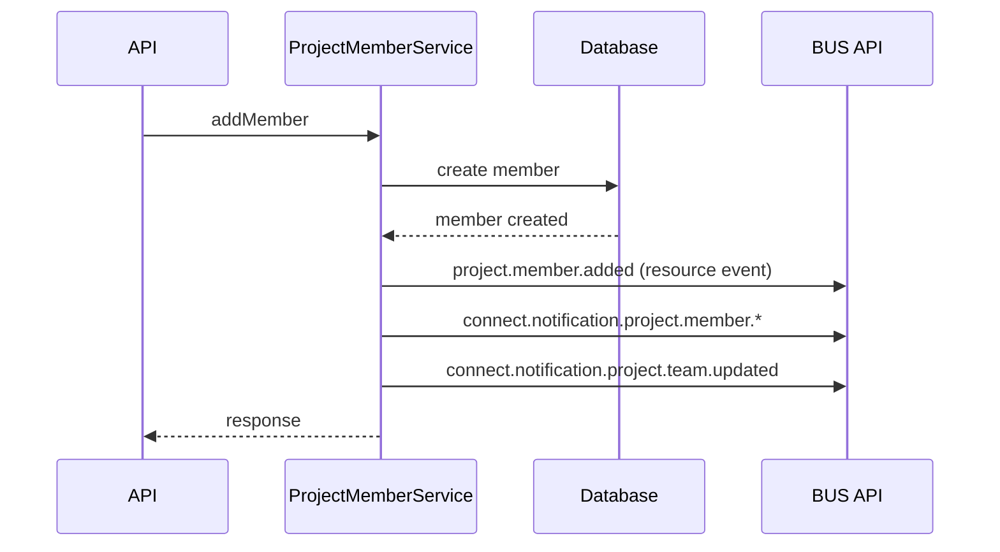
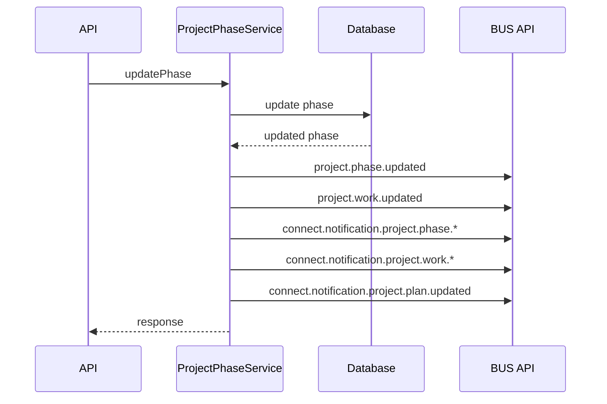

# Event Schemas

This document describes event topics emitted by `project-service-v6`.

## Event Types

- `BUS API resource events`: payload format `{ resource, data }`
- `Notification events`: flat payload for downstream notification consumers

## BUS API Resource Event Shape

```json
{
  "topic": "project.phase.updated",
  "originator": "project-service-v6",
  "timestamp": "2026-02-07T12:00:00.000Z",
  "mime-type": "application/json",
  "payload": {
    "resource": "project.phase",
    "data": {}
  }
}
```

## Notification Event Shape

```json
{
  "topic": "connect.notification.project.updated",
  "originator": "project-service-v6",
  "timestamp": "2026-02-07T12:00:00.000Z",
  "mime-type": "application/json",
  "payload": {
    "projectId": "1001",
    "projectName": "Demo Project",
    "projectUrl": "https://platform.topcoder.com/connect/projects/1001",
    "userId": "123",
    "initiatorUserId": "123"
  }
}
```

## Topics By Category

### Project
- `project.draft.created`
- `project.updated`
- `project.deleted`
- `project.status.changed`
- `connect.notification.project.created`
- `connect.notification.project.updated`
- `connect.notification.project.submittedForReview`
- `connect.notification.project.approved`
- `connect.notification.project.active`
- `connect.notification.project.paused`
- `connect.notification.project.completed`
- `connect.notification.project.canceled`
- `connect.notification.project.updated.spec`
- `connect.notification.project.linkCreated`
- `connect.notification.project.billingAccount.updated`
- `connect.notification.project.plan.updated`
- `connect.notification.project.plan.ready`

### Member
- `project.member.added`
- `project.member.updated`
- `project.member.removed`
- `connect.notification.project.member.joined`
- `connect.notification.project.member.copilotJoined`
- `connect.notification.project.member.managerJoined`
- `connect.notification.project.member.left`
- `connect.notification.project.member.removed`
- `connect.notification.project.member.assignedAsOwner`
- `connect.notification.project.team.updated`

### Invite
- `project.member.invite.created`
- `project.member.invite.updated`
- `project.member.invite.deleted`
- `connect.notification.project.member.invite.sent`
- `connect.notification.project.member.invite.accepted`

### Attachment
- `project.attachment.added`
- `project.attachment.updated`
- `project.attachment.removed`
- `connect.notification.project.fileUploaded`
- `connect.notification.project.attachment.updated`
- `connect.notification.project.linkCreated`

### Phase / Work
- `project.phase.added`
- `project.phase.updated`
- `project.phase.removed`
- `project.work.added`
- `project.work.updated`
- `project.work.removed`
- `connect.notification.project.phase.transition.active`
- `connect.notification.project.phase.transition.completed`
- `connect.notification.project.phase.update.payment`
- `connect.notification.project.phase.update.progress`
- `connect.notification.project.phase.update.scope`
- `connect.notification.project.work.transition.active`
- `connect.notification.project.work.transition.completed`
- `connect.notification.project.work.update.payment`
- `connect.notification.project.work.update.progress`
- `connect.notification.project.work.update.scope`

### Phase Product / Work Item
- `project.phase.product.added`
- `project.phase.product.updated`
- `project.phase.product.removed`
- `project.workitem.added`
- `project.workitem.updated`
- `project.workitem.removed`
- `connect.notification.project.product.update.spec`
- `connect.notification.project.workitem.update.spec`

### Workstream
- `project.workstream.added`
- `project.workstream.updated`
- `project.workstream.removed`

### Timeline / Milestone
- `timeline.added`
- `timeline.updated`
- `timeline.removed`
- `milestone.added`
- `milestone.updated`
- `milestone.removed`
- `connect.notification.project.timeline.adjusted`
- `connect.notification.project.timeline.milestone.added`
- `connect.notification.project.timeline.milestone.updated`
- `connect.notification.project.timeline.milestone.removed`
- `connect.notification.project.timeline.milestone.transition.active`
- `connect.notification.project.timeline.milestone.transition.completed`
- `connect.notification.project.timeline.milestone.transition.paused`
- `connect.notification.project.timeline.milestone.waiting.customer`

### Project Setting
- `project.setting.created`
- `project.setting.updated`
- `project.setting.deleted`

## Payload Field Notes

- `projectId`: string id of the project.
- `projectName`: current project name at event time.
- `projectUrl`: work-manager URL for the project.
- `userId`: actor user id from JWT.
- `initiatorUserId`: same as `userId` for internal service operations.
- `refCode`: optional marketing/reference code from `project.details.utm.code`.
- `inviteId`: string id of the invite.
- `memberId`: string id of the created/resolved project member.
- `role`: project role for the invite/member.
- `email`: invite target email when available.
- `handle`: invite target handle when available.

## Old -> New Mapping (tc-project-service to project-service-v6)

| Old Event | New Topic |
|---|---|
| `connect.notification.project.submittedForReview` | `connect.notification.project.submittedForReview` |
| `connect.notification.project.approved` | `connect.notification.project.approved` |
| `connect.notification.project.updated.spec` | `connect.notification.project.updated.spec` |
| `connect.notification.project.team.updated` | `connect.notification.project.team.updated` |
| `connect.notification.project.timeline.adjusted` | `connect.notification.project.timeline.adjusted` |

## Sequence: Create Project



## Sequence: Add Member



## Sequence: Update Phase


